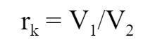
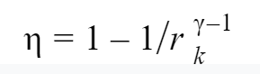

## INTRODUCTION 

Otto cycle is a thermodynamics cycle used to describe the working of a spark ignition (petrol) engine. It describes how the chemical energy of gasoline is turned into thermal energy, which is then used to power the motion of a vehicle.

#### User Objectives and Goals: 

1. Understand the various processes involved in the Otto cycle.
2. Portray the change in the graph as the parameters are changed.
3. Visualize the piston movements in the engine as the parameters change.
4. Calculate the compression ratio.
5. Calculate the efficiency of the Otto cycle.

#### Theory 

Otto cycle is a thermodynamics cycle used to describe the working of a spark ignition (petrol) engine. It describes how the chemical energy of gasoline is turned into thermal energy, which is then used to power the motion of a vehicle.

The various processes involved are explained below:

0-1 - Intake phase, which is an isobaric process that takes the air-fuel mixture into the engine chamber, as the piston goes to BDC.

1-2 - This is the isentropic compression phase, where the air-fuel mixture is compressed by the piston as it goes up. At 2, the air-fuel mixture is ready to be ignited by the spark plug.

2-3 - This is the constant volume heat addition, where the air-fuel mixture undergoes combustion. The combustion of the mixture is complete at 3, and is at maximum pressure and high thermal energy.

3-4 - This is the isentropic expansion phase, where the thermal energy performs work on the piston, pushing it down so that the volume increases. This is the power stroke, as this provides motion for the vehicle.

4-1 - This is the constant volume heat rejection phase, where the remaining wasted heat is expelled from the engine chamber. The pressure reduces as the kinetic energy of the gas molecules goes down.

1-0 - The remaining exhaust gases are removed from the chamber through a constant pressure method.

In this experiment, the Otto cycle is demonstrated so that the user can understand how the P-V graph changes as various pressure and volume parameters change.

#### Abbreviations: 

1. P1, v1, T1 = Pressure, volume and temperature values at the beginning of Process 1-2
2. P2, v2, T2 = Pressure, volume and temperature values at the beginning of Process 2-3
3. P3, v3, T3 = Pressure, volume and temperature values at the beginning of Process 3-4
4. P4, v4, T4 = Pressure, volume and temperature values at the beginning of Process 4-1
5. γ = Heat capacity ratio (adiabatic index)
6. rk = Compression ratio
7. Efficiency (╖) = Efficiency of Otto Cycle

#### Equations/formulae: 

 

 
