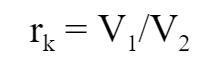
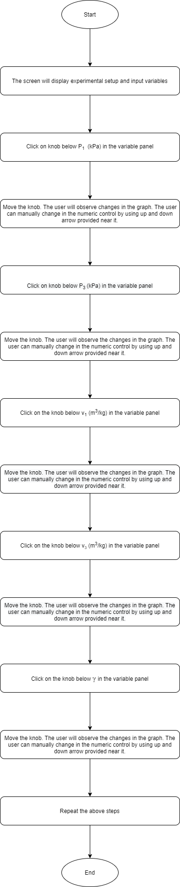
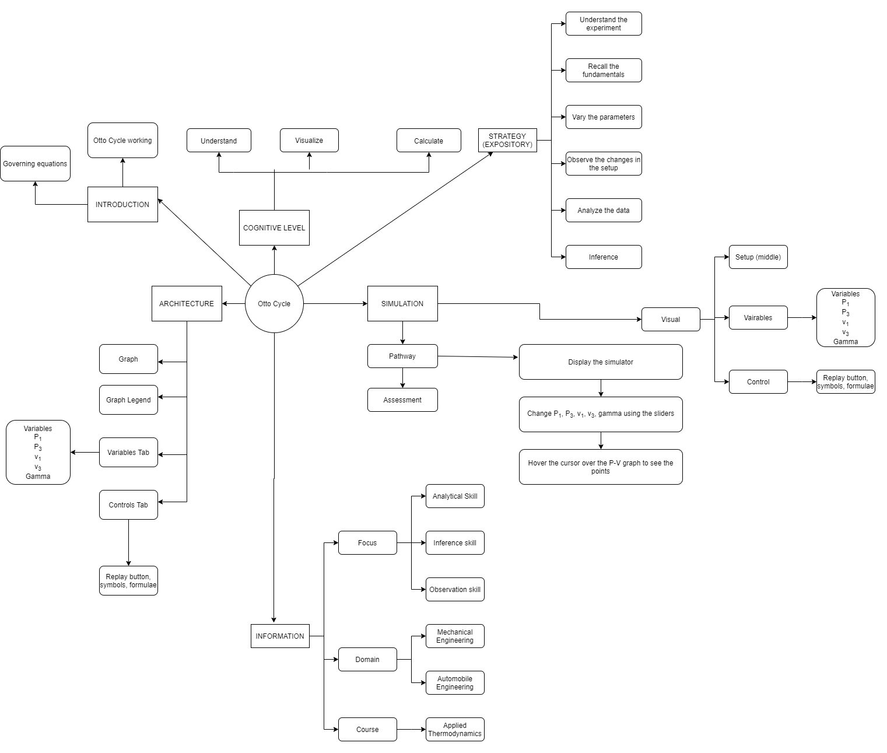
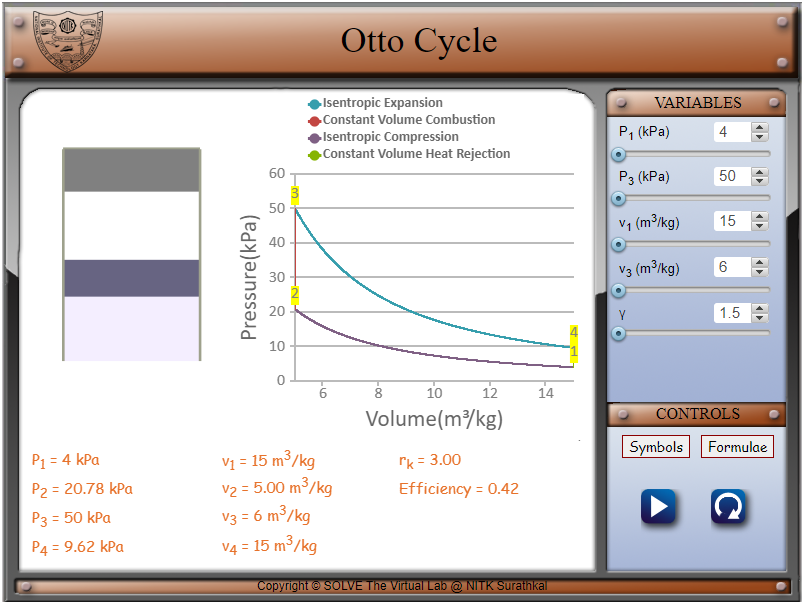
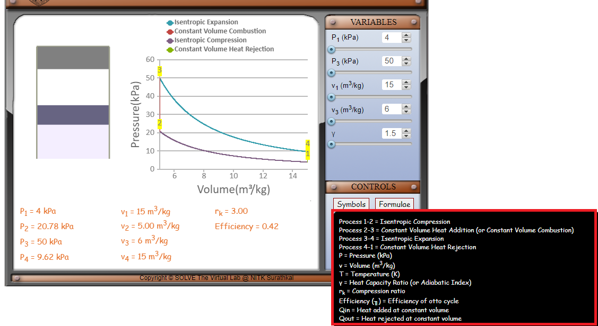
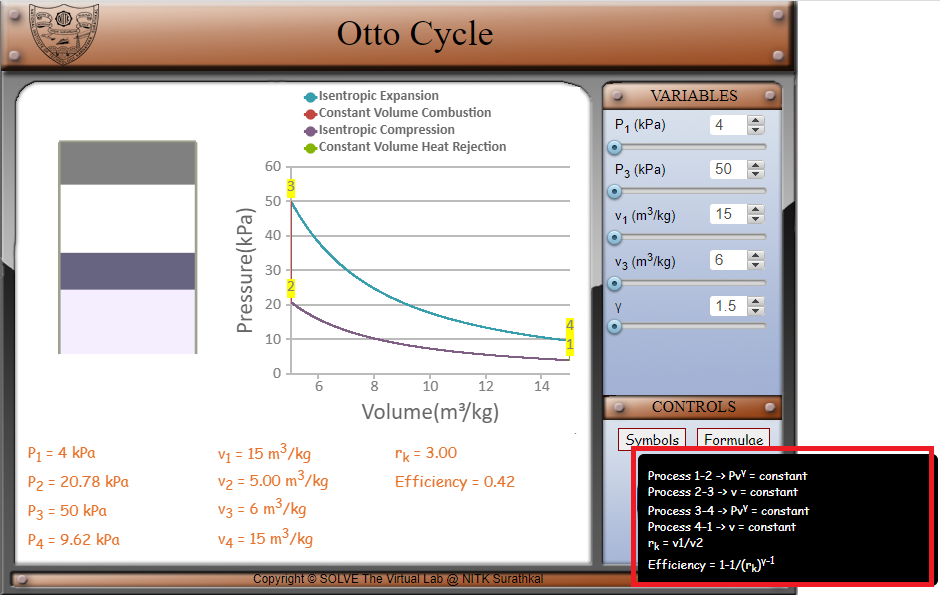
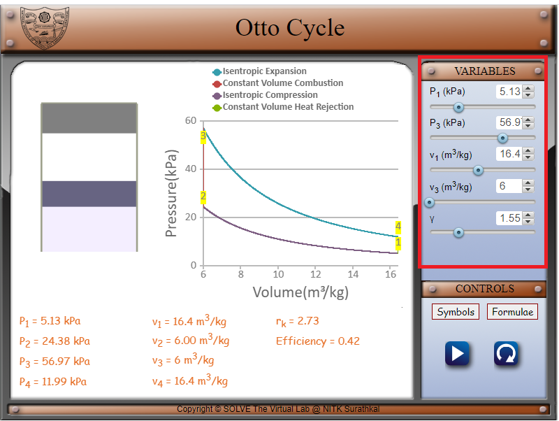
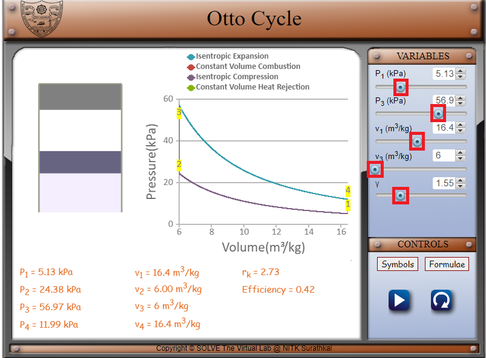
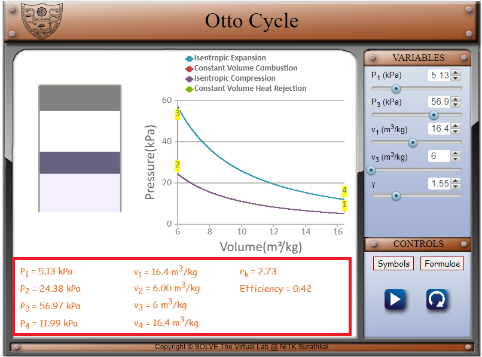
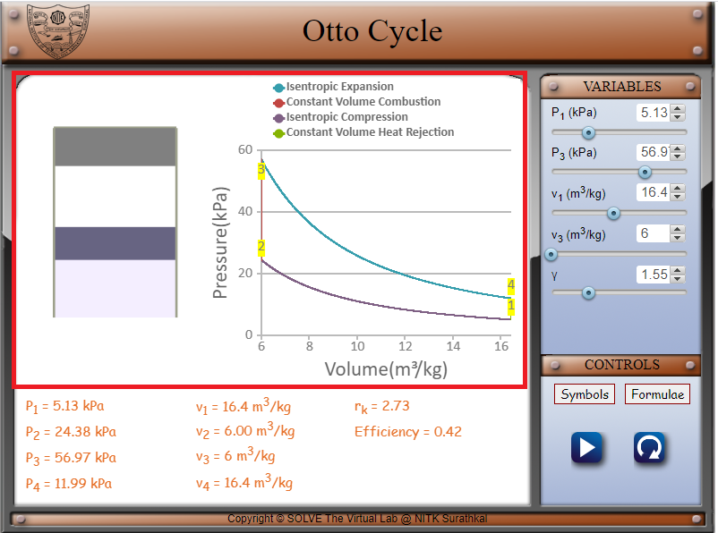

## Storyboard (Round 2)

Experiment: Otto Cycle

**1. Story Outline**:

Otto cycle is a thermodynamics cycle used to describe the working of a spark ignition (petrol) engine. It describes how the chemical energy of gasoline is turned into thermal energy, which is then used to power the motion of a vehicle.

The various processes involved are explained below:

0-1 - Intake phase, which is an isobaric process that takes the air-fuel mixture into the engine chamber, as the piston goes to BDC.

1-2 - This is the isentropic compression phase, where the air-fuel mixture is compressed by the piston as it goes up. At 2, the air-fuel mixture is ready to be ignited by the spark plug.

2-3 - This is the constant volume heat addition, where the air-fuel mixture undergoes combustion. The combustion of the mixture is complete at 3, and is at maximum pressure and high thermal energy.

3-4 - This is the isentropic expansion phase, where the thermal energy performs work on the piston, pushing it down so that the volume increases. This is the power stroke, as this provides motion for the vehicle.

4-1 - This is the constant volume heat rejection phase, where the remaining wasted heat is expelled from the engine chamber. The pressure reduces as the kinetic energy of the gas molecules goes down.

1-0 - The remaining exhaust gases are removed from the chamber through a constant pressure method.

In this experiment, the Otto cycle is demonstrated so that the user can understand how the P-V graph changes as various pressure and volume parameters change.

 **2. Story**:

  **2.1 Set the visual stage description**:

  The experiment consists of the Otto cycle P-V graph. All the buttons and parameters control the right corner of the frame. The variable panel contains sliders for the pressures P1 and P3 and the volumes V1 and V3 and the heat capacity ratio γ.

  The setup consists of a graph that depicts the Otto cycle. A legend at the top indicates the processes involved in each of the curves. There is also a piston cylinder made up of a top-open rectangle and the piston made up of another rectangle that passes through the cylinder.

  By changing the various parameters, the P-V graph changes and the piston moves up and down indicating the various processes in accordance with the change in the graph.

  **2.2 Set User Objectives & Goals**:

  1. Understand the various processes involved in the Otto cycle.
  2. Portray the change in the graph as the parameters are changed.
  3. Visualize the piston movements in the engine as the parameters change.
  4. Calculate the compression ratio.
  5. Calculate the efficiency of the Otto cycle.

  **2.3 Set the pathway activities**:

  1. The initial P1 is taken as 4 kPa. 
  2. The initial P3 is taken as 50 kPa. 
  3. The initial V1 is taken as 15 m3/kg. 
  4. The initial V3 is taken as 5 m3/kg. 
  5. The initial heat capacity ratio γ is taken as 1.5. 
  6. P1 is varied from 4 to 6 kPa using a slider. 
  7. P3 is varied from 50 to 60 kPa using a slider. 
  8. V1 is varied from 15 to 18 m3/kg using a slider. 
  9. V3 is varied from 5 to 6 m3/kg using a slider. 
  10. The heat capacity ratio γ is varied from 1.5 to 1.68 using a slider. 

  Change the parameters of the system to understand the behaviour of the Otto cycle.

  **2.4 Set Challenges and Questions/Complexity/variation**

  **2.4.a Questions before simulation**:

  1. The Otto cycle is employed for which type of engine?

    <ol type="a">
   <li>Spark ignition engine</li>
   <li>Compression ignition engine</li>
   <li>Both of the above</li>
   </ol>

   Answer: a

  2. The correct sequence of processes for the Otto cycle is:

  <ol type="a">
  <li>Expansion - Combustion - Heat removal - Compression</li>
  <li>Compression - Heat removal - Expansion - Combustion</li>
  <li>Compression - Combustion - Expansion - Heat removal</li>
  <li>Combustion - Expansion - Heat removal - Compression</li>
  </ol>

  Answer: c

  3. The Otto cycle consists of:

  <ol type="a">
  <li>Two isochores and two isothermal curves</li>
  <li>Two isobars and two isothermal curves</li>
  <li>Two isochores and two reversible adiabatic curves</li>
  <li>Two isobars and two reversible adiabatic curves</li>
  </ol>

  Answer: c

  4. The pressure is maximum at the end of which process:

   <ol type="a">
  <li>Isentropic compression</li>
  <li>Constant volume combustion </li>
  <li>Isentropic expansion</li>
  <li>Constant volume heat removal</li>
  </ol>

  Answer: b

  5. The efficiency of an Otto cycle can be increased by:

   <ol type="a">
  <li>Increasing the compression ratio</li>
  <li>Decreasing the compression ratio</li>
  <li>Increasing the temperature</li>
  <li>Decreasing the temperature</li>
  </ol>

  Answer: a

**2.4.b Questions after simulation**

6. Consider the heat capacity ratio γ to be 1.4. If the compression ratio of an air standard Otto cycle is 8, what is the efficiency?

<ol type="a">
<li>56</li>
<li>48</li>
<li>28</li>
<li>32</li>
</ol>
Answer: a

7. The ratio of the actual thermal efficiency of a vehicle to its air standard efficiency is known as ________ efficiency.

<ol type="a">
<li> brake</li>
<li> mechanical</li>
<li> volumetric</li>
<li> relative</li>
</ol>

Answer: d

8. If P1 = 5.39 kPa and the compression ratio is 3.1, what is P2 for an air standard Otto cycle?

<ol type="a">
<li>29.25 kPa</li>
<li>35.73 kPa</li>
<li>36.16 kPa</li>
<li>38.54 kPa</li>
</ol>

Answer: c

9. If the compression ratio of the Otto cycle changes from 5 to 6, the percent change in the air standard efficiency is

<ol type="a">
<li>1%</li>
<li>20%</li>
<li>16.67%</li>
<li>8%</li>

Answer: d

10. In an SI engine, when the air-fuel mixture is ready to be ignited by the spark plug, the volume of the mixture is 4 m3/kg. What is the volume of the at the end of the combustion process?

<ol type="a">
<li>5.56 m3/kg</li>
<li>4 m3/kg</li>
<li>3.9 m3/kg</li>
<li>6.62 m3/kg</li>

Answer: b

**2.5 Allow pitfalls: NA**

**2.6 Conclusion**:

The time required to perform the virtual experiment.

The approximate time to understand the procedure and perform the experiment would take about 5 mins. The time required to understand the change in the Otto cycle P-V graph as the parameters are changed is about 5 mins. The time taken to calculate the compression ratio, efficiency and such parameters is about 5 mins. Thus, the total time required to perform the experiment is about 15 mins.

**2.7a Abbreviations:**

1. P1, v1, T1 = Pressure, volume and temperature values at the beginning of Process 1-2
2. P2, v2, T2 = Pressure, volume and temperature values at the beginning of Process 2-3
3. P3, v3, T3 = Pressure, volume and temperature values at the beginning of Process 3-4
4. P4, v4, T4 = Pressure, volume and temperature values at the beginning of Process 4-1
5. γ = Heat capacity ratio (adiabatic index)
6. rk = Compression ratio
7. Efficiency (╖) = Efficiency of Otto Cycle

**2.7b Equations/formulae:**

 

 

 

<!-- # Below are the examples added for reference.
# To get mathematical equatios in html format: go to link: https://www.codecogs.com/latex/eqneditor.php and download equations in png format
# In the same link you have option to download equation as punching

### using png -->
<!--
//markdown syntax -->

<!-- //html syntax

 -->

**3. Flowchart**:

**4. Mindmap**:

**5. storyboard**:

1. In the simulation window, the Otto cycle graph and the piston are displayed.

 

2. The various symbols and the formulae involved in the experiment are displayed in the control panel when the cursor hovers over ‘Symbols’ and ‘Formulae’ respectively.

 

 

3. The parameters of the system can be changed by changing the variables as shown below. 

 

4. Move the sliders’ knobs to vary the pressures P1 and P3, the volumes v1 and v3 and gamma. P1 can be varied from 4 to 6 kPa. P3 can be varied from 50 to 60 kPa. V1 can be varied from 15 to 18 m3/kg. V3 can be varied from 5 to 6 m3/kg and gamma can be varied from 1.5 to 1.68. 

 

5. P1, P2, P3, P4, v1, v2, v3, v4, the compression ratio rk and the efficiency are displayed at the bottom. 

 

6. Visualize the change in the graph and the piston movement as the various parameters are changed.

 

**6. References**:

Basic and Applied Thermodynamics - P.K. Nag
Thermodynamics: An Engineering Approach - Yunus A Cengel, Michael A Boles
